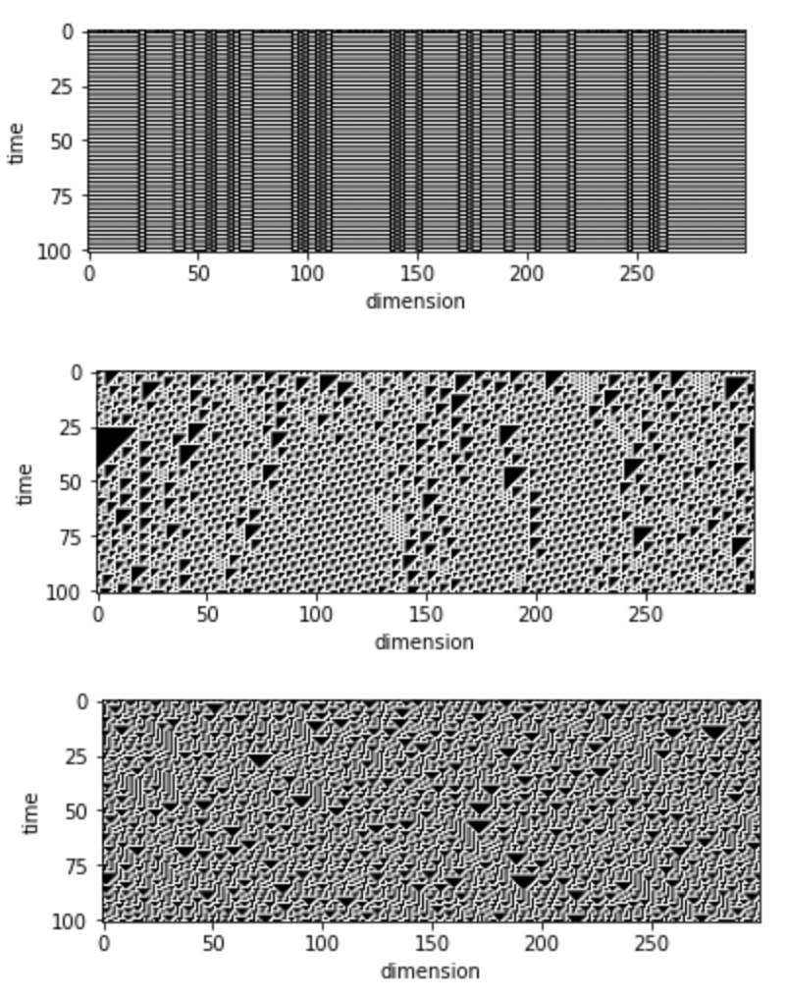
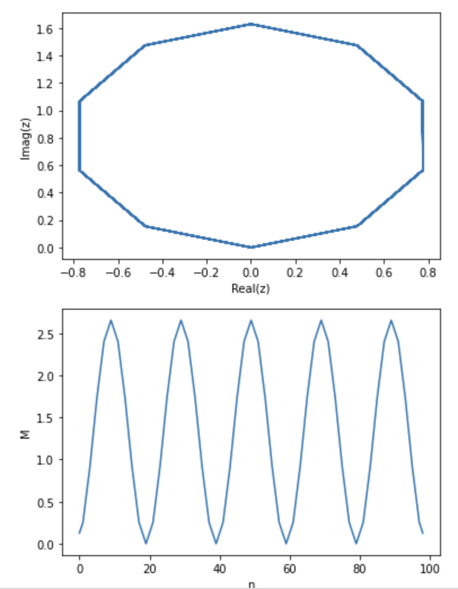
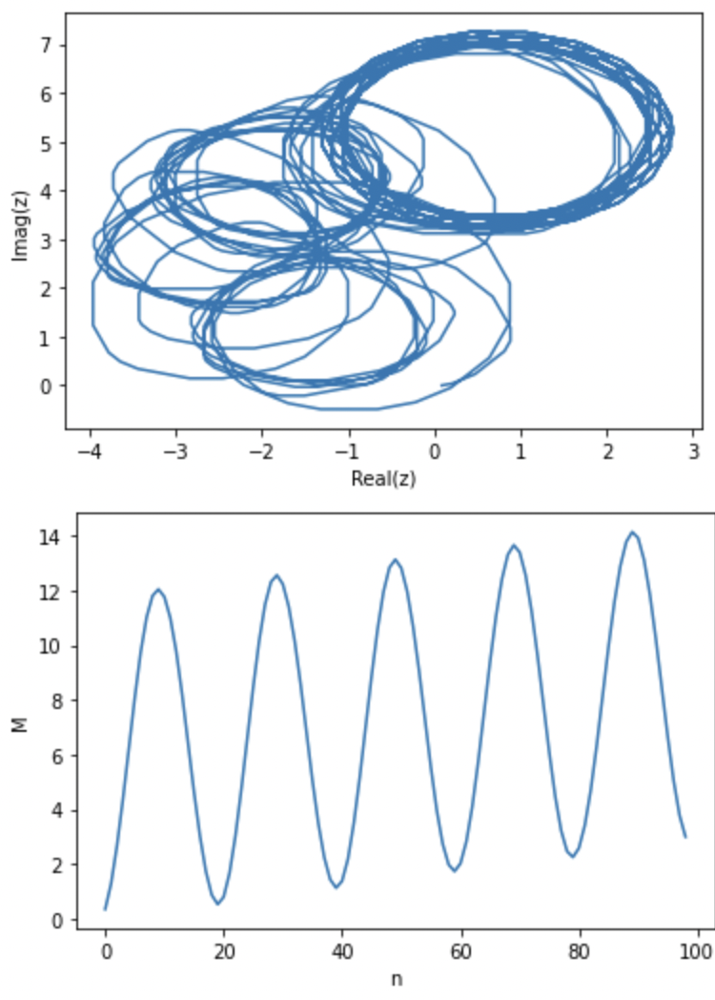
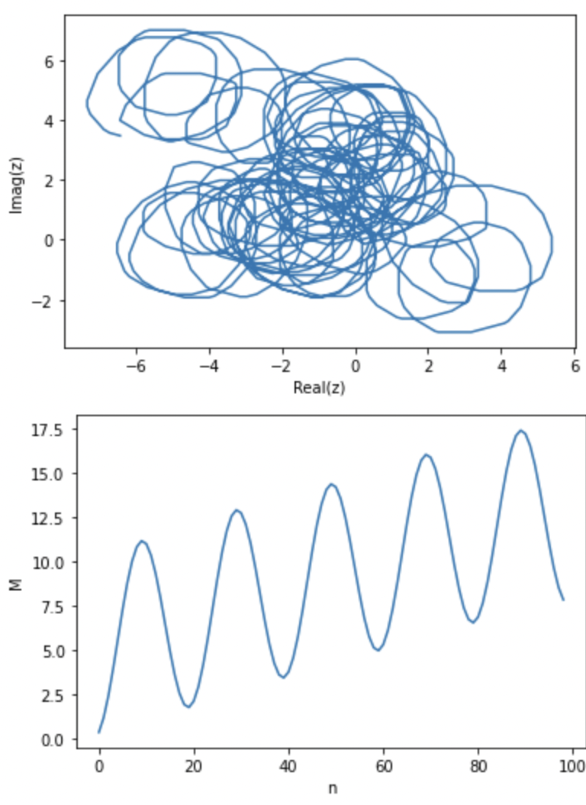

# 0-1Test
The 0-1 Test for Chaos

### Example using 1D ECAs
```python
phi_regular = observables(max_time=1000,dimension=300,eca_rule=1,display=True)
phi_edge = observables(max_time=1000,dimension=300,eca_rule=110,display=True)
phi_chaos = observables(max_time=1000,dimension=300,eca_rule=30,display=True)
```


```python
O1TestForChaos.test_for_chaos(observables=phi_regular,n_angles=10,display=True)
```

> -0.04076938313921742

```python
O1TestForChaos.test_for_chaos(observables=phi_edge,n_angles=10,display=True)
```

> 0.3407182394463175

```python
O1TestForChaos.test_for_chaos(observables=phi_chaos,n_angles=10,display=True)
```

> 0.8591552135412148

### Appendix: Loading in 1D-ECA data
```pip install eca```

```python
from typing import List

from matplotlib.pyplot import imshow, show 
from eca import OneDimensionalElementaryCellularAutomata

def observables(max_time:int, dimension:int, eca_rule:int, display:bool=False) -> List[float]:
    ca = OneDimensionalElementaryCellularAutomata(lattice_width=dimension)
    for _ in range(max_time):
        ca.transition(rule_number=eca_rule)
    if display:
        imshow(ca.evolution())
        show()
    trajectory_grays_encoded,_ = zip(*ca.trajectory())
    max_value = 2**dimension
    return list(map(
        lambda value:value/max_value,
        trajectory_grays_encoded
    ))
```
